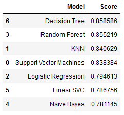

# Titanic - Machine Learning from Disaster
In this notebook we perform some data analysis on Titanic dataset provided on Kaggle. 

The objective of this task is to predict the survival rate of passengers. It's clearly a classification probem, thus we can use several machine learning or deep learning techniques to tackle this problem. In this case I am using typical machine learning technics such as: Support Vector Machines, KNN, Logistic Regression, Random Forest, Naive Bayes, Linear SVC, Decision Tree. Before applying the ML techniques to data first it is necessary to perform some data preprocessing to unfold some correlations between different features, including some feature removal or creating some additional more descriptive features. 

By plotting data we can check some dependencies that is neccasarry to know in order to know which features we need to prioritize and which ones to ignore. Below for example is given the clear dependancy between age and survivale rate

By uncovering such dependencies we can transform data, for example in case of age feature instead of continous data we can select the age range that is more or less likely to survive. 

After the preprocessing now the above mentioned machine learning techniques are applied to predict the results. Accuracy scores of each technique is given below

